# Architecture — HLD, LLD, Data Model, Flows

This document is the structural reference for the harness: what the components are, how
data moves between them, and what the database holds. It complements the other two docs
rather than repeating them:

| Document | Answers |
|---|---|
| `README.md` | How do I use it? |
| **`ARCHITECTURE.md`** (this file) | **How is it built?** |
| `DESIGN_NOTES.md` | *Why* is it built this way — trade-offs, rejected alternatives, and the failures behind them. |

---

## 1. High-Level Design

### 1.1 What the system is

A CLI that packages a repository at a pinned commit into a container, proves the container
is a valid evaluation environment, runs a solver against it without letting the solver see
the tests it will be graded on, and grades the resulting patch — recording every invocation
in a queryable ledger.

The whole design turns on one constraint:

> **The environment that produces a patch must never be the environment that grades it.**

Everything below is a consequence of that sentence.

### 1.2 System context

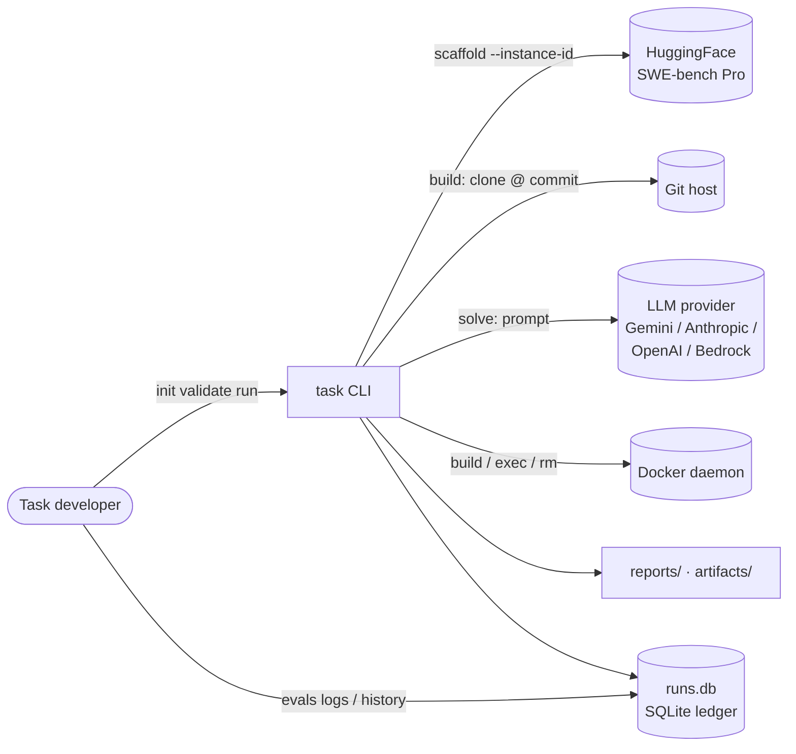

The CLI is the only component that talks to everything else. Nothing calls back into it,
there is no daemon, and no state lives outside `runs.db`, `reports/`, and `artifacts/`.

### 1.3 Component view

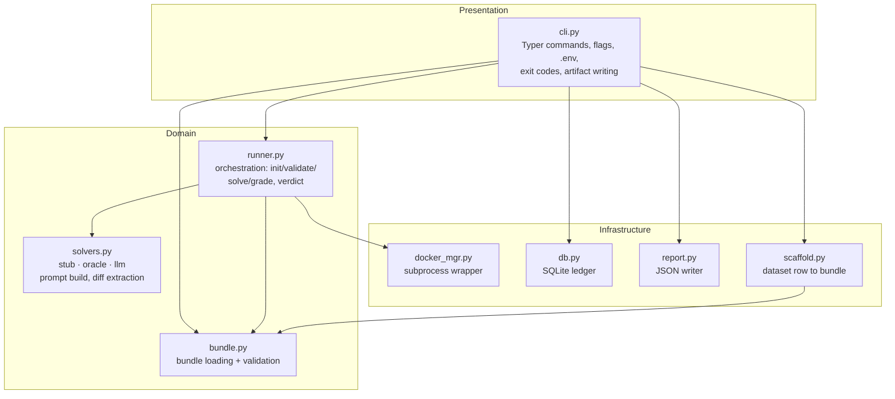

Dependencies point strictly downward. `runner.py` never imports `cli.py`, `db.py`, or
`report.py` — which is what makes `Runner` usable as a library and testable without a
database.

### 1.4 The trust boundary

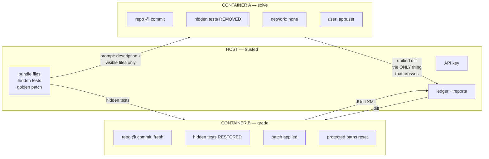

Two properties fall out of this shape:

1. **The solver cannot see the graded tests.** They are `rm -rf`'d from the image at build
   time (`hidden_paths`), so they are absent from container A's filesystem entirely — not
   hidden behind a permission, not masked by a mount. Every *other* test in the repo stays
   visible, which is the point — the solver should see the repo the way a developer joining
   it would, minus the answer key.
2. **The solver cannot influence its own grade.** Only a unified diff crosses back. It is
   re-applied in a *fresh* container, and `protected_paths` (conftest.py, pytest.ini, …) are
   reset from git afterwards, so a patch that edits test infrastructure has that edit undone
   before anything runs.

The API key lives only on the host. Container A has `--network none` and never sees it — the
LLM call is made by the host process, which passes the model file contents it read out of
the container.

---

## 2. Data Model

### 2.1 Bundle on disk

A bundle is a directory. It is the unit of everything — versionable, diffable, no database
required to interpret it.

```
bundles/vuls-redhat-001/
├── task.json                        # the spec: repo, commit, commands, hidden paths
├── description.md                   # what the solver is told (problem + requirements)
├── patch.diff                       # golden patch — oracle solver only, never shown to LLM
├── source_row.json                  # provenance: the dataset row this came from
└── tests/
    ├── pass2pass/                   # must pass before AND after  (regression tripwire)
    │   ├── _selected_tests.txt      # which test names this bucket owns
    │   └── scanner/redhatbase_test.go
    └── fail2pass/                   # must FAIL before, PASS after (proof of fix)
        ├── _selected_tests.txt
        └── scanner/redhatbase_test.go
```

Bucket directories **mirror repo-relative paths**. That is not cosmetic: the runner restores
these files to their original locations in the container, because Go and Java tests must sit
in their package directory to compile at all, and JS tests using relative `require('../src')`
break the moment they move.

The same file legitimately appears in both buckets — a single `_test.go` usually contains
both pass2pass and fail2pass cases. Bucket separation therefore happens at the **results**
level, not the execution level (§4.5).

### 2.2 `task.json`

| Field | Required | Purpose |
|---|:---:|---|
| `task_id` | ✓ | Bundle identity; forms the image tag |
| `repo` | ✓ | Clone URL |
| `commit` | ✓ | Full SHA. HEAD is pinned here and never moves |
| `test_cmd` | ✓ | Must contain `{path}` or `{dirs}`; `{report}` = JUnit XML destination |
| `deps_cmd` | ✓ | Dependency install, run as root before the baseline snapshot |
| `hidden_paths` | | Repo-relative files deleted from the image so the solver can't see them |
| `base_image` | | Defaults to `python:3.11-slim`; set to a prebuilt benchmark image for Pro |
| `setup_cmd` | | Root prep. **Must leave `git` on PATH** — the build fails loudly otherwise |
| `protected_paths` | | Reset before grading. Defaults to conftest/pytest.ini/tox.ini/sitecustomize |

Validation is strict and fails with actionable messages: absolute paths and `..` traversal
are rejected, and a Windows drive letter in any command is caught explicitly (Git Bash
rewrites POSIX paths on the way in, and the resulting error inside a Linux container is
otherwise baffling).

### 2.3 Database schema

One table. SQLite, stdlib `sqlite3`, no ORM, WAL journaling so `evals history` in a second
terminal can read while a run writes.

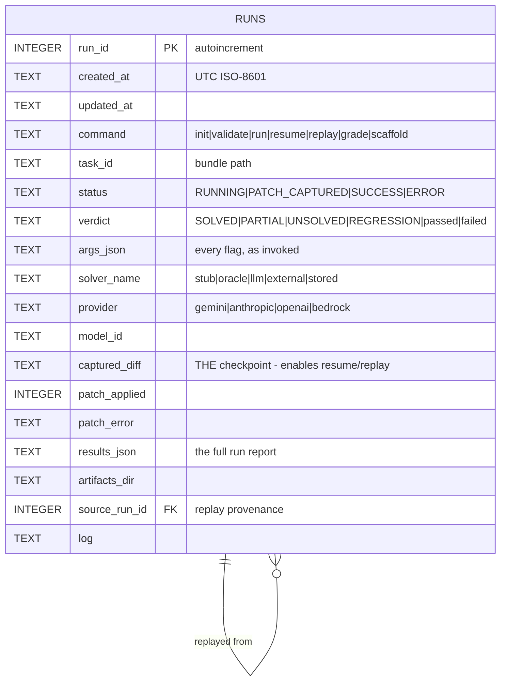

**`status` and `verdict` are deliberately separate columns.** Conflating them makes "did
this crash?" unanswerable for a run that produced a verdict, and leaves `init`/`validate` —
which have a lifecycle but no solver verdict — with nowhere to sit.

**Migrations are in-place.** `CREATE TABLE IF NOT EXISTS` is a no-op on an existing table, so
a v1 `runs.db` would fail with "no such column" on the first write after a schema change.
`_MIGRATIONS` adds missing columns idempotently, and the legacy `ts NOT NULL` column from v1
is still satisfied on insert so old databases keep working instead of needing deletion.

`update_run` takes an explicit column allowlist rather than interpolating caller keys into
SQL — internal callers only today, but that is the pattern that becomes an injection bug the
first time a key comes from anywhere else.

### 2.4 Ledger lifecycle

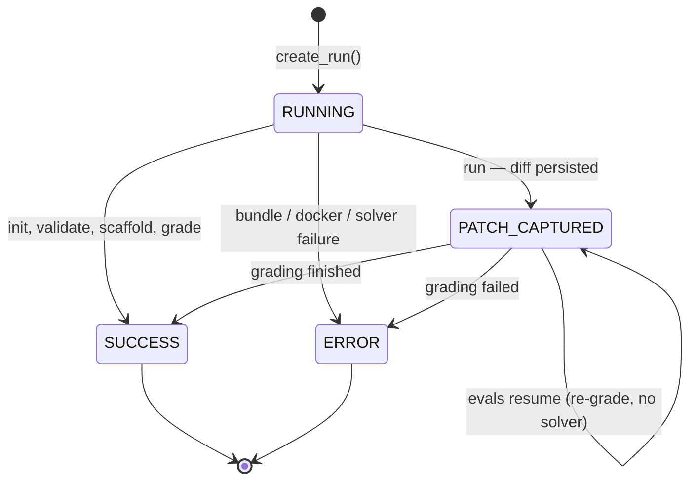

`PATCH_CAPTURED` is the load-bearing state. The diff is written to the ledger **the moment
it exists**, before grading starts, so a crash or a harness bug after that point never costs
another inference call. `evals resume <id>` finishes such a run; `evals replay <id>` re-grades
it as a *new* run linked by `source_run_id`.

---

## 3. Image build (`evals init`)

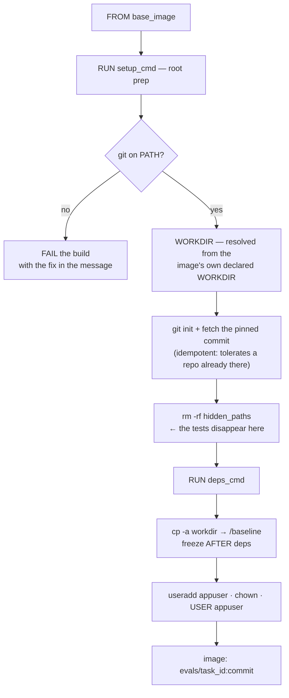

Three decisions worth stating:

**The workdir is read from the image, not hardcoded.** `docker inspect --format
'{{.Config.WorkingDir}}'`. SWE-bench Pro's prebuilt images ship the repo at `/app` with
dependencies installed against that exact path; cloning a second copy into `/workspace` and
patching *that* is how a correct patch came to be graded as a failure — the patch landed in
`/workspace` while Python imported the untouched copy from `/app`. Nothing in the output said
so. If `inspect` returns nothing the image is pulled first, because BuildKit pulls base
images into its own cache where `docker inspect` cannot see them.

**The commit is fetched, not cloned.** A full clone of ansible or teleport is gigabytes of
history that lands in every image *and* every `/baseline` copy. The build fetches the single
pinned SHA, falls back to a full clone if the host refuses, and asserts
`git rev-parse HEAD == commit` either way.

**`/baseline` is frozen after `deps_cmd`.** So it matches exactly what the solver starts from
— editable-install `.egg-info` metadata already present on both sides — which is what makes
the later `git diff --no-index` capture clean.

---

## 4. Low-Level Design

### 4.1 Module responsibilities

| Module | LoC | Responsibility |
|---|---:|---|
| `cli.py` | 684 | 11 Typer commands, `.env` loading, artifact writing, exit codes |
| `runner.py` | 1103 | `Runner.init/validate/solve/grade`, verdict logic, JUnit parsing |
| `solvers.py` | 1085 | 3 solvers, 4 providers, prompt construction, diff extraction/repair |
| `bundle.py` | 243 | `TaskBundle` / `TaskSpec`, structural + semantic validation |
| `scaffold.py` | 352 | SWE-bench Pro dataset row → bundle directory |
| `db.py` | 208 | `RunDB`: ledger, migrations, allowlisted updates |
| `docker_mgr.py` | 191 | Thin `subprocess` wrapper over the docker CLI |
| `report.py` | 16 | JSON writer |
| `tests/unit_checks.py` | 623 | 30 dependency-free checks |

### 4.2 Key types

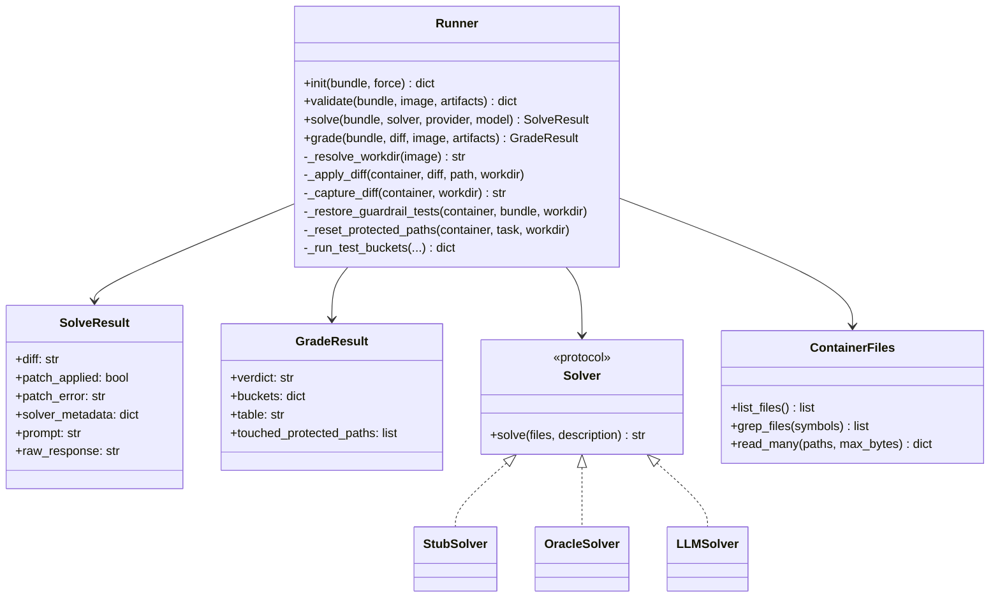

`solve()` and `grade()` are separate public methods, and `run()` is only their composition.
That separation is what makes `resume`, `replay`, and `grade --diff-file` possible: grading
an existing patch never has to involve a solver, or an API key.

### 4.3 `evals run` — the full sequence

```mermaid
sequenceDiagram
    participant U as User
    participant C as cli.py
    participant D as RunDB
    participant R as Runner
    participant A as Container A (solve)
    participant L as LLM
    participant B as Container B (grade)

    U->>C: evals run <bundle> --solver llm
    C->>D: create_run() → run_id, status=RUNNING
    C->>R: solve(...)
    R->>A: docker run --network none --user appuser
    R->>A: list_files / grep_files / read_many
    A-->>R: repo file contents (hidden tests absent)
    R->>L: prompt (description + files + checklist)
    L-->>R: unified diff
    R->>A: git apply (ladder, §4.4)
    R->>A: cp workdir → /current; git diff /baseline /current
    A-->>R: normalized diff
    R->>A: docker rm -f
    R-->>C: SolveResult

    Note over C,D: CHECKPOINT — the expensive artifact is persisted here
    C->>D: update_run(status=PATCH_CAPTURED, captured_diff=...)
    C->>C: write artifacts/run-N/

    C->>R: grade(diff)
    R->>B: docker run (fresh container, same image)
    R->>B: git apply diff
    R->>B: reset protected_paths from git
    R->>B: restore pass2pass + fail2pass tests in place
    R->>B: run test_cmd once → JUnit XML
    B-->>R: results.xml
    R->>B: docker rm -f
    R-->>C: GradeResult (verdict)
    C->>D: finish_run(SUCCESS, verdict)
    C->>U: table + verdict + report path
```

### 4.4 The apply ladder

A patch whose *intent* was unambiguous should not be rejected over bookkeeping. Rungs are
tried strictest-first; anything past the first is announced in the run output.

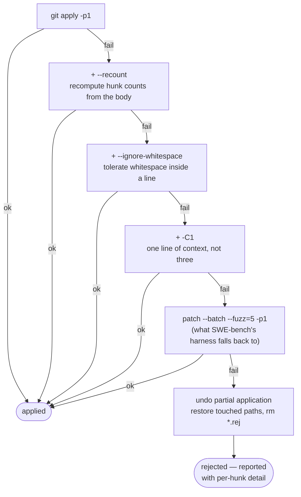

None of the rungs can change what a patch *means*: added and removed lines must still match
exactly. Only `-C1` and `--fuzz` weaken *where* a hunk may land, which is why they are last.

GNU `patch` is not all-or-nothing — it applies what it can and leaves `.rej` files — so a
failed fuzz attempt is explicitly undone. The undo is scoped to the paths the diff names
rather than `git checkout -- .`, which would resurrect the hidden test files: they are gone
from the working tree but still present in `HEAD`, so a blanket checkout would silently
defeat the entire hiding mechanism.

### 4.5 Test execution and result partitioning

pass2pass and fail2pass usually live in the **same file**, so they cannot be executed
separately once restored to their real repo paths. The runner therefore runs `test_cmd`
**once** and splits the results afterwards.

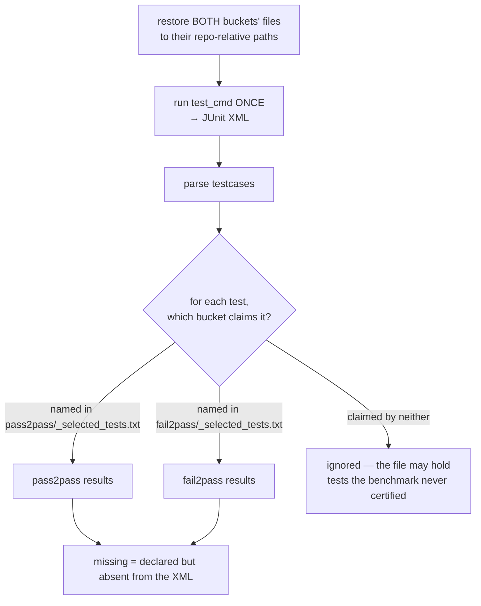

**Missing-test detection matters more than it sounds.** A test that vanished — deleted by the
solver, or a collection/compile error — is simply *absent* from the XML, so `all(passed)` over
the survivors is still `True`. Without this check, a patch that does not compile scores
pass2pass green. It is what turned a Go compile error into a correct `REGRESSION` verdict
rather than a false pass.

Test-id normalisation handles the three runner conventions:

| Runner | Manifest id | JUnit `name` |
|---|---|---|
| pytest | `test/units/test_vars.py::TestVars::test_x` | `test_x` |
| jest | `test/db.js \| Test database \| should work` | `Test database should work` |
| go | `TestHTTPConnState/without_client_certs` | unchanged — `/` is a *subtest* separator |

### 4.6 Verdict logic

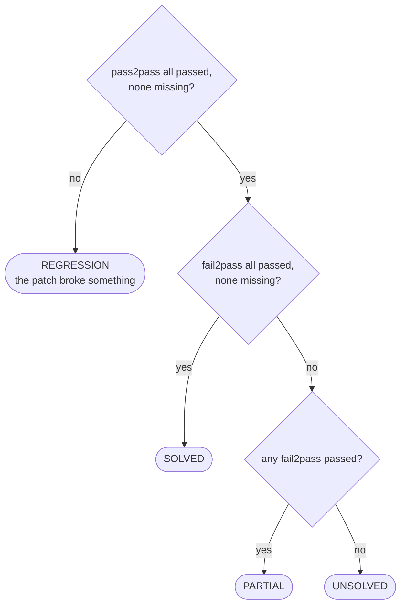

`validate` uses the same partitioning with the **expectation flipped**: pass2pass must all
pass and fail2pass must all *fail*. That is the baseline invariant, and it is what proves the
bundle is a valid task rather than a broken one — a fail2pass test
that already passes is testing nothing.

### 4.7 Solver layer

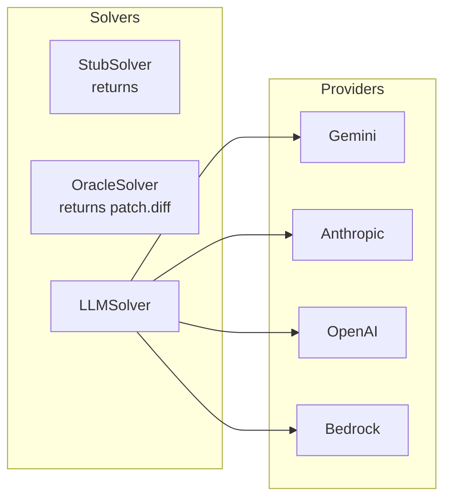

`stub` and `oracle` are not toys — they are the two control conditions. `stub` must produce
`UNSOLVED` (nothing changed) and `oracle` must produce `SOLVED` (the golden patch). Together
they prove the harness itself distinguishes a fix from a non-fix, independently of any model,
and they cost nothing to run.

The LLM prompt is assembled in this order, with the closing checklist deliberately placed
*after* the file contents — a 350 KB prompt puts every up-front instruction ~86,000 tokens
before the point where generation begins:

```
role + anti-memorisation warning → FORMAT rules → SCOPE rules
  → quote-block requirement (chain-of-extraction)
  → ## Task description  (+ note: Requirements = acceptance criteria)
  → ## Repository files   (names only)
  → ## File contents      (whole files, ranked, never truncated)
  → ## Files NOT shown    (named, so gaps are known rather than guessed)
  → ## Before you answer  (5-rule verification checklist)
  → ## Additional guidance (--append-prompt, append-only)
```

File selection is a 4-tier ranking, because "the description names this exact path" is far
stronger evidence than "some file shares this basename":

| Tier | Signal |
|---:|---|
| 0 | description contains the file's full repo-relative path |
| 1 | file **contains a symbol** the description names (found by `grep` *inside* the container) |
| 2 | basename or stem appears in the description |
| 3 | everything else |

Tier 1 exists because most descriptions name functions, not files. `vuls-redhat-001` names
`parseInstalledPackagesLine` and `splitFileName` and never mentions `scanner/redhatbase.go`,
so path- and basename-ranking had nothing to work with and the file that needed changing was
never shown to the model at all.

Files are inlined **whole or not at all**. A truncated file is worse than an absent one: the
model cannot tell it is truncated and fills the gap from memory. Excluded files are named
under `## Files NOT shown`.

---

## 5. Cross-cutting concerns

### 5.1 Isolation

| Surface | Container A (solve) | Container B (grade) |
|---|---|---|
| Network | `--network none` | `--network none` |
| User | `appuser`, non-root | `appuser`, non-root |
| Memory | 2 GB cap | 2 GB cap |
| Hidden tests | **absent from the filesystem** | restored |
| API key | never present | never present |
| Lifetime | force-removed in `finally` | force-removed in `finally` |

Each side gets exactly one dangerous capability and never both: container A can run arbitrary
model-authored code but has no network and no tests to read; container B has the tests but
the code it runs has already been frozen into a diff and stripped of test-infrastructure
edits.

### 5.2 Reproducibility — and its honest limit

Pinned and deterministic: the commit SHA, the image tag (`evals/<task_id>:<commit>`), the
baseline snapshot, the test command, bucket attribution, and the verdict function. Re-grading
the same diff always yields the same verdict — which is exactly what `evals replay` exercises.

**The LLM is not reproducible, and `temperature=0` does not make it so.** Measured here: two
runs of the same bundle sent byte-identical 346,614-byte prompts and returned materially
different patches — one `PARTIAL`, one `REGRESSION`. Any conclusion drawn from a single
sample per prompt variant is measuring noise, not the change.

This is why the ledger stores the captured diff as a first-class column rather than
re-deriving it, and why `replay` re-grades a *stored* patch instead of re-running inference:
the only reproducible thing about an LLM run is the artifact it already produced.

### 5.3 Observability

Every invocation of every command gets a ledger row — including failures, and including
`init` and `scaffold`. Three levels of detail:

| Level | Where | Contains |
|---|---|---|
| Summary | `evals history` | id, timestamp, command, task, verdict/status |
| Structured | `reports/*.json`, `results_json` | full per-test outcomes, buckets, solver metadata |
| Forensic | `artifacts/run-N/` (`--keep-artifacts`) | prompt, raw response, raw diff, captured diff, JUnit XML, test log |

Solver metadata records what actually varied: provider, model, latency, temperature, the
effective reasoning level, token usage (prompt / thinking / output), whether the provider
retried, how many files were inlined, and how many matched by symbol. The first question
after two differing runs is always "what changed?", and this is the answer.

The prompt and raw response are written **before** the provider call returns, so a rejected
API key, a 429, or an exhausted output budget still leaves the evidence behind — a failed
solve is precisely when the raw response matters most.

---

## 6. Extending to another language

Nothing in the harness is Python-specific; results are read from JUnit XML, which every
mainstream runner can emit. Adding a language is a `task.json` change, not a code change:

| Field | Python | Go | JavaScript |
|---|---|---|---|
| `base_image` | `python:3.11-slim` | `golang:1.22` | `node:20-slim` |
| `setup_cmd` | apt git + pip pytest | apt git + `go install go-junit-report` | apt git + `npm i -g jest-junit` |
| `deps_cmd` | `pip install -e .` | `go mod download` | `npm ci` |
| `test_cmd` | `pytest {path} --junitxml={report}` | `go test -v {dirs} \| go-junit-report > {report}` | `jest {path} --reporters=jest-junit` |

The three shipped bundles cover two languages and both build paths — `toy-calc-001` (Python,
built from a plain base image) and `ansible-vars-001` / `vuls-redhat-001` (Python and Go,
both on SWE-bench Pro's prebuilt per-instance images).
